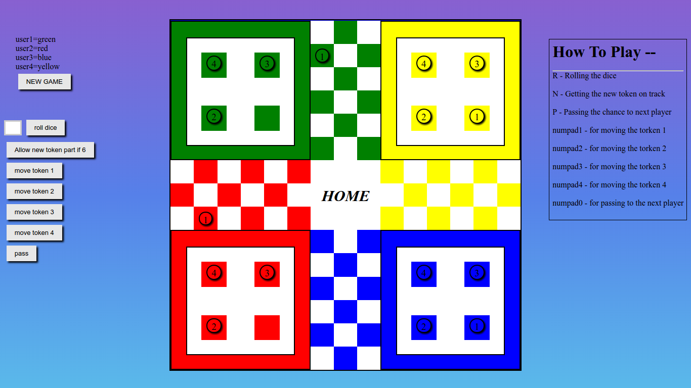

The game is available at https://harsh-98.github.io/ludo

It is web implementation of Ludo.I have used simple html,css and vanilla js for developing this game.
The layout is made using div element(not using canvas).

# How To Play

Just enter the number of players then press  `R` for rolling the dice and numpad keys `1-4` for moving different token ___(!plz check num-lock)___ and `P` for passing to the next player.

